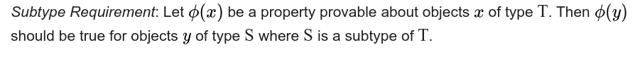

# SOLID Principles in Modern C++

---
transition: fade-out
---

# The SOLID Principles

- **S**: Single-Responsibility Principle
- **O**: Open-Closed Principle
- **L**: Liskov Substitution Principle
- **I**: Interface Segregation Principle
- **D**: Dependency Inversion Principle

[SOLID on Wikipedia](https://en.wikipedia.org/wiki/SOLID)

---

# S**O**LID: Open-Closed Principle

- > software entities (classes, modules, functions, etc.) should be open for extension, but closed for modification.[^1]
- It should not be possible or necessary to change the code of an entity
- Still it should be possible to change the behavior of the entity


[^1]: : Meyer, Bertrand (1988). Object-Oriented Software Construction. Prentice Hall.

---

# The Actor in a Real Vehicle

- The Power Train could be either a combustion engine or electrical motor
- The brake could support either just comfort brakes or emergency brakes
- Can we control the handbrake?
- The steering wheel could be controllable via steering wheel angles or steering moments
- Some systems without a steering system might not provide a steering wheel at all
- **It highly depends on the system required by the customer**

---

# The Actor in our Current Implementation

```cpp {all|3-5,10,14,16-18,22}
class Actors {
 public:
  void control_power_train(const Trajectory & /*trajectory*/) {}
  void control_brake(const Trajectory & /*trajectory*/) {}
  void control_steering_wheel(const Trajectory & /*trajectory*/) {}
};

class DrivingSystem {
public:  
  DrivingSystem(std::shared_ptr<Sensor> sensor,
                std::shared_ptr<Planner> planner,
                std::shared_ptr<Actors> actor) :
    ...
    actor->control_brake(vehicle_trajectory);
    actor->control_power_train(vehicle_trajectory);
    actor->control_steering_wheel(vehicle_trajectory);
  }
 private:
  ...
  std::shared_ptr<Actors> actor;
};
```
---

# The Open-Closed Principle for the Actor

- We could try to implement one `Actor` class which supports all use cases (Single Responsibility)
- We want to be able to use different `Actor` implementations without changing the code of the `DrivingSystem`
- Solution in object-oriented software: Provide different implementations via *abstractions*

---

# An Abstract Actor

```cpp {0-5|7-20}
class Actor {
 public:
  virtual ~Actor() = default;
  virtual void control_vehicle(const Trajectory &) = 0;
};

class PowerTrain : public Actor {
 public:
  void control_vehicle(const Trajectory &) override {};
};

class Brake : public Actor {
 public:
  void control_vehicle(const Trajectory &) override {};
};

class SteeringWheel : public Actor {
 public:
  void control_vehicle(const Trajectory &) override {};
};
```

---

# Using the Abstract Actor in the Driving System

```cpp
class DrivingSystem {
 public:
  using Actors = std::vector<std::shared_ptr<Actor>>;

  DrivingSystem(std::shared_ptr<Sensor> sensor,
                std::shared_ptr<Planner> planner,
                Actors actors) :
  ...
  void one_cycle() {
    ...
    for (auto &actor : actors)
      actor->control_vehicle(vehicle_trajectory);
  }

 private:
  ...
  Actors actors;
};
```
---

# Bootstrapping the Actors

```cpp {all|5-7,10}
int main() {
  auto sensor = std::make_shared<Sensor>();
  auto planner = std::make_shared<Planner>();

  auto power_train = std::make_shared<PowerTrain>();
  auto brake = std::make_shared<Brake>();
  auto steering_wheel = std::make_shared<SteeringWheel>();

  DrivingSystem driving_system(sensor, planner,
                               {power_train, brake, steering_wheel});
  driving_system.one_cycle();
}
```
---

# Liskov Substitution Principle
<br>

 [^1] 

- If Base is a subclass of Class, then Class should behave like Base
- > Subtypes must be substitutable for their base types.
- With inheritance, we should model an **is-a** relation 

<br>
<br>

[^1]: : Liskov, Barbara; Wing, Jeannette (1994-11-01). A behavioral notion of subtyping. ACM Transactions on Programming Languages and Systems.

---

# Some derived Implications


- Preconditions cannot be strengthened in a subtype
- Postconditions cannot be weakened in a subtype
- Invariants of the super type must be preserved in a subtype

[^1]

[^1]: [Breaking Dependencies: The SOLID Principles - Klaus Iglberger - CppCon 2020](https://www.youtube.com/watch?v=Ntraj80qN2k)

---

# Moving to More Realistic Actors

- Actors can not generate arbitrary forces
- The range of forces is depending on the type of vehicle
- Open-Closed Principle: We want to change the limits from outside

---

# The Naive Approach

```cpp {all|3,8,15,20}
class Actor {
...
virtual void set_limit(double /*limit*/) = 0;
};

class PowerTrain final : public Actor {
...
  void set_limit(double acceleration_limit_metres_per_second) override {
...
double max_acceleration_metres_per_second{0};
};

class Brake final : public Actor {
...
  void set_limit(double deceleration_limit_metres_per_second) override {
...

class SteeringWheel final : public Actor {
...
  void set_limit(double torque_limit_newton_metres) override {
...
```
---

# Following the Liskov Substitution Principle

Let's revert our mistake from before:
```cpp
class Actor {
 public:
  virtual ~Actor() = default;
  virtual void control_vehicle(const Trajectory & /*trajectory*/) = 0;
};
```

And move the limit to the constructor of the base class:
```cpp
class PowerTrain final : public Actor {
 public:
  explicit PowerTrain(const Acceleration& acceleration_limit) : acceleration_limit(acceleration_limit) {}
  void control_vehicle(const Trajectory &) override {};
 private :
  Acceleration acceleration_limit;
} 
```
---

# Following the Liskov Substitution Principle II

```cpp{all|3,11}
class Brake final : public Actor {
 public:
  explicit Brake(const Acceleration& deceleration_limit) : deceleration_limit(deceleration_limit) {};
  void control_vehicle(const Trajectory &) override {};
 private:
  Acceleration deceleration_limit;
};

class SteeringWheel final : public Actor {
 public:
  explicit SteeringWheel(const Torque& torque_limit) : torque_limit(torque_limit) {}
  void control_vehicle(const Trajectory &) override {};
 private:
  Torque torque_limit;
};
```
---

# Setting the Actual Limits

```cpp{all|4,6,8}
int main(int, char **) {
  ...
  auto power_train = std::make_shared<PowerTrain>(
    Acceleration{MetresPerSquareSecond{13.6}});
  auto brake = std::make_shared<Brake>(
    Acceleration{MetresPerSquareSecond{21.0}});
  auto steering_wheel = std::make_shared<SteeringWheel>(
    Torque{NewtonMetre{3.0}});

  DrivingSystem driving_system(sensor, planner,
                               {power_train, brake, steering_wheel});
  ...
}
```

---

# Safety Aspects of a Real Driving System

- Normal driving (e.g. on a highway) requires only a limited functionality of our actors
- Any emergency situation (e.g. emergency braking into standstill) requires maximum actor capability
- As safety plays a major role we need to handle these situations separately:

   a) normal situations - limitations for actors

   b) special situations - permission for actors to use extended limits


---

# Extension of the Abstract Actor


```cpp {0|1|3,6}
enum class DrivingMode { normal, emergency };

class Actor {
 public:
  virtual ~Actor() = default;
  virtual void control_vehicle(const Trajectory &, const DrivingMode &) = 0;
};
```
---

# Extension of Existing Brake Actor

```cpp {1|6-10|8,13-21}
class Brake final : public Actor {
 public:
  explicit Brake(const Acceleration &deceleration_limit) : deceleration_limit(
      deceleration_limit) {};

  void control_vehicle(const Trajectory &,
                       const DrivingMode &driving_mode) override {
    auto &current_limit = get_current_deceleration_limit(driving_mode);
    std::cout << current_limit << std::endl;
  };

 private:
  [[nodiscard]] const Acceleration &
  get_current_deceleration_limit(const DrivingMode &driving_mode) const {
    static const Acceleration
        unlimited_deceleration{std::numeric_limits<double>::lowest()};
    if (driving_mode == DrivingMode::normal)
      return deceleration_limit;
    else
      return unlimited_deceleration;
  }

  Acceleration deceleration_limit;
};
```

---

# Extension of Existing Powertrain Actor

```cpp {6,10-11|10-15|2-4,12-15}

class DrivingModeNotSupported : public std::logic_error {
  using std::logic_error::logic_error;
};

class PowerTrain final : public Actor {
 public:
  explicit PowerTrain(const Acceleration &acceleration_limit)
      : acceleration_limit(acceleration_limit) {}
  void control_vehicle(const Trajectory &,
                       const DrivingMode &driving_mode) override {
    if (driving_mode == DrivingMode::emergency)
      throw DrivingModeNotSupported(
          "Power train won't operate in emergency mode.");
  };
 private :
  Acceleration acceleration_limit;
};
```

---

# SOL**I**D: Interface Segregation Principle

- > clients should not be forced to depend on methods that they do not use.[^2]
- interfaces shall help to decouple, not introduce artifical coupling
- prefer multiple smaller interfaces to enable clients depending only on interfaces which are relevant for them
- interface segregation is an important special case of the Single-Responsibility Principle 


[^2]: : Martin, Robert C. (2013). Agile Software Development, Principles, Patterns, and Practices. Pearson.

---

# The Interface Segregation Principle for the Actor
- `Actor` implementations shall not be forced to know about the `DrivingMode`
- Interface changes shall only force `Actor` implementations to change for relevant reasons
- We could try to separate the `DrivingMode` related interface
- Only `Actor` implementations which use the `DrivingMode` really know about it
- Solution in object-oriented software: Provide multiple *abstractions*

---

# Separation of Abstract Actor

```cpp {1-5|7-10|1-5,12-18|7-10}
class Actor {
 public:
  virtual ~Actor() = default;
  virtual void control_vehicle(const Trajectory &) = 0;
};

class DrivingModeAwareActor : public Actor {
 public:
  virtual void set_driving_mode(const DrivingMode &) = 0;
};

class PowerTrain final : public Actor {
 public:
  explicit PowerTrain(const Acceleration &acceleration_limit)
      : acceleration_limit(acceleration_limit) {}
  void control_vehicle(const Trajectory &) override {...};
  ...
};
```

---

# Usage for Driving Mode aware Actors
```cpp {1-4|11-13,16,18,23|6-9}
class Brake final : public DrivingModeAwareActor {
 public:
  explicit Brake(const Acceleration &deceleration_limit) : deceleration_limit(
      deceleration_limit) {};

  void control_vehicle(const Trajectory &) override {
    auto &current_deceleration_limit = get_current_deceleration_limit();
    std::cout << current_deceleration_limit << std::endl;
  }

  void set_driving_mode(const DrivingMode &driving_mode) override {
    current_driving_mode = driving_mode;
  }

 private:
  [[nodiscard]] const Acceleration & get_current_deceleration_limit() const {
    ...
    if (current_driving_mode == DrivingMode::normal)
      ...
  }

  Acceleration deceleration_limit;
  DrivingMode current_driving_mode{DrivingMode::normal};
};
```
---

# Usage of the Driving Mode
```cpp {all|11-15}
int main(int, char **) {
  auto sensor = std::make_shared<Sensor>();
  auto planner = std::make_shared<Planner>();
  auto power_train = std::make_shared<PowerTrain>(Acceleration{MetresPerSquareSecond(13.6)});
  auto brake = std::make_shared<Brake>(Acceleration{MetresPerSquareSecond{21.0}});
  auto steering_wheel = std::make_shared<SteeringWheel>(Torque{NewtonMetre{3.0}});

  DrivingSystem driving_system(sensor, planner,
                               {power_train, brake, steering_wheel});

  const auto driving_mode = DrivingMode::normal;
  brake->set_driving_mode(driving_mode);
  steering_wheel->set_driving_mode(driving_mode);

  driving_system.one_cycle();
}
```
---
layout: center
---

# Time for a review...

---
layout: two-cols
---


<template v-slot:default>

## PROs

- interfaces for `Actor` and `DrivingModeAwareActor` are now separated
- implementations for both are decoupled

## CONs

- `DrivingModeAwareActor` require internal logic to select own `limits`
- poor testability of this logic
- smells like Single-Responsibility is not ensured anymore

</template>
<template v-slot:right>

```cpp {all|11-12}
int main(int, char **) {

  ...

  DrivingSystem 
   driving_system(sensor, planner,
                  {power_train, brake, 
                   steering_wheel});

  const auto driving_mode = DrivingMode::normal;
  brake->set_driving_mode(driving_mode);
  steering_wheel->set_driving_mode(driving_mode);

  driving_system.one_cycle();
}
```

</template>

---

# Extract Logic for Actor Limits

- introduction of `ActorLimitHandler` (implemented as singleton):
```cpp {1,7,10,16|1-5,17-18|all}
class ActorLimitHandler {
public:
    static ActorLimitHandler& get_instance () {
        static ActorLimitHandler actor_limiter;
        return actor_limiter;
    }
    void set_driving_mode(const DrivingMode &driving_mode) {
        current_driving_mode = driving_mode;
    }
    Acceleration get_current_deceleration_limit() {
        if (current_driving_mode == DrivingMode::normal)
            return deceleration_limit;
        else
            return unlimited_deceleration{std::numeric_limits<double>::lowest()};
    }
    Torque get_current_torque_limit(){...};
private:
    ActorLimitHandler() = default;
    Acceleration deceleration_limit{Acceleration{MetresPerSquareSecond{21.0}}};
    Torque torque_limit{Torque{NewtonMetre{3.0}}};
    DrivingMode current_driving_mode{DrivingMode::normal};
};
```

---

# Usage of Actor Limit Handler
- `DrivingModeAwareActor` gets obsolete
```cpp {1-9|6|11-22}
class Brake final : public Actor {
 public:
  Brake() = default;

  void control_vehicle(const Trajectory &) override {
    auto current_deceleration_limit = ActorLimitHandler::get_instance().get_current_deceleration_limit();
    std::cout << current_deceleration_limit << std::endl;
  };
};
...
int main(int, char **) {
  ...
  auto driving_mode = DrivingMode::normal;
  ActorLimitHandler::get_instance().set_driving_mode(driving_mode);

  driving_system.one_cycle();

  driving_mode = DrivingMode::emergency;
  ActorLimitHandler::get_instance().set_driving_mode(driving_mode);

  driving_system.one_cycle();
}
```

---

# SOLI**D**: Dependency Inversion Principle

- > The most flexible systems are those in which source code dependencies refer only to abstractions, not to concretions[^3]
- low-level implementations shall depend on high-level abstractions, not the other way around!
- architectural detail: abstractions shall be owned by the high-level, not the low-level


[^3]: : Martin, Robert C. (2017). Clean Architecture: A Craftsman's Guide to Software Structure and Design. Pearson.


---

# Dependencies of the Actors
- Actors have to depend on the implementation of `ActorLimitHandler`
- if `ActorLimitHandler` changes, `Brake` has to be re-compiled
- clear violation of the Dependency Inversion Principle

Possible Solution: 
- Actors define (and own) an interface to receive their current limit
- a low-level module (like the `ActorLimitHandler`) has to implement & fulfil the interface for each actor


---

# Dependency Inversion for Actors
```cpp {1|2,4-5,13|1-14|16-24}
using DecelerationLimitCallback = std::function<Acceleration()>;
class Brake final : public Actor {
 public:
  explicit Brake(DecelerationLimitCallback get_deceleration_limit) : get_current_deceleration_limit(
          std::move(get_deceleration_limit)) {};

  void control_vehicle(const Trajectory &) override {
    auto current_deceleration_limit = get_current_deceleration_limit();
    std::cout << current_deceleration_limit << std::endl;
  };

 private:
    DecelerationLimitCallback get_current_deceleration_limit;
};

using TorqueLimitCallback = std::function<Torque()>;
class SteeringWheel final : public Actor {
 public:
  explicit SteeringWheel(TorqueLimitCallback get_torque_limit)
      : get_current_torque_limit(std::move(get_torque_limit)) {}
  void control_vehicle(const Trajectory &) override {/*...*/};
 private:
    TorqueLimitCallback get_current_torque_limit;
};
```

---

# Driving System
```cpp {5-6|7-8|9-10|15-23}
int main(int, char **) {
  ...
  auto power_train = std::make_shared<PowerTrain>(
      Acceleration{MetresPerSquareSecond(13.6)});
  auto actor_limiter = std::make_shared<ActorLimitHandler>(Acceleration{MetresPerSquareSecond{21.0}},
                                                           Torque{NewtonMetre{3.0}});
  auto brake = std::make_shared<Brake>(
          [&actor_limiter]() {return actor_limiter->get_current_deceleration_limit();});
  auto steering_wheel = std::make_shared<SteeringWheel>(
          [&actor_limiter]() {return actor_limiter->get_current_torque_limit();});

  DrivingSystem driving_system(sensor, planner,
                               {power_train, brake, steering_wheel});

  auto driving_mode = DrivingMode::normal;
  actor_limiter->set_driving_mode(driving_mode);

  driving_system.one_cycle();

  driving_mode = DrivingMode::emergency;
  actor_limiter->set_driving_mode(driving_mode);

  driving_system.one_cycle();
}
```

---